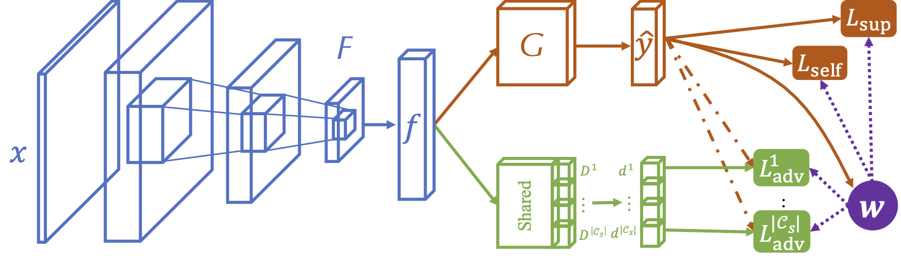

Code for our TPAMI paper [**From Big to Small: Adaptive Learning to Partial-Set Domains**](https://arxiv.org/abs/2203.07375)



### Prerequisites:
- python == 3.6.8
- pytorch ==1.1.0
- torchvision == 0.3.0
- numpy, scipy, PIL, argparse, tqdm

### Dataset:

- Please manually download the datasets [Office](https://drive.google.com/file/d/0B4IapRTv9pJ1WGZVd1VDMmhwdlE/view), [Office-Home](https://drive.google.com/file/d/0B81rNlvomiwed0V1YUxQdC1uOTg/view), [ImageNet-Caltech](http://www.vision.caltech.edu/Image_Datasets/Caltech101/101_ObjectCategories.tar.gz) from the official websites, and modify the path of images in each '.txt' under the folder 'data/', [VisDA-2017](http://ai.bu.edu/visda-2017/), [OpenMIC](http://users.cecs.anu.edu.au/~koniusz/openmic-dataset/),

### Training:
1. ##### Partial Domain Adaptation (PDA) on the Office-Home dataset [Art(s=0) -> Clipart(t=1)] Art:0,Clipart:1,Product:2,Real_World:3
	```For SAN++
    python run_san.py --s 0 --t 1 --dset office_home --net ResNet50 --cot_weight 0. --mu 0 --self_training pseudo --ent_weight 1. --conf_thres 0.85 --output ArCl_san++ --gpu_id 0
    ```

    ```For SAN++ w/ COT
    python run_san.py --s 0 --t 1 --dset office_home --net ResNet50 --cot_weight 1. --mu 0 --self_training pseudo --ent_weight 1. --conf_thres 0.85 --output ArCl_san++cot --gpu_id 0
	```
	
2. ##### Partial Domain Adaptation (PDA) on the Office dataset [Amazon(s=0) -> DSLR(t=1)], Amazon:0,DSLR:1,Webcam:2
	```For SAN++
    python run_san.py --s 0 --t 1 --dset office_home --net ResNet50 --cot_weight 0. --mu 0 --self_training pseudo --ent_weight 1. --conf_thres 0.8 --output AD_san++ --gpu_id 0
    ```

    ```For SAN++ w/ COT
    python run_san.py --s 0 --t 1 --dset office_home --net ResNet50 --cot_weight 5. --mu 0 --self_training pseudo --ent_weight 1. --conf_thres 0.8 --output AD_san++cot --gpu_id 0
	```
   
3. ##### Partial Domain Adaptation (PDA) on the ImageNet-Caltech dataset [ImageNet(s=0) -> Caltech(t=1)]
   ```FOR SAN++
  python run_san.py --s 0 --t 1 --dset imagenet_caltech  --net ResNet50 --cot_weight 0. --mu 0 --self_training pseudo --ent_weight 1. --conf_thres 0.85 --output IC_san++ --gpu_id 0
   ```

   ```FOR SAN++ w/ COT
   python run_san.py --s 0 --t 1 --dset imagenet_caltech  --net ResNet50 --cot_weight 1. --mu 0 --self_training pseudo --ent_weight 1. --conf_thres 0.85 --output IC_san++cot --gpu_id 0
   ```

4. ##### Partial Domain Adaptation (PDA) on the VisDA-2017 dataset [Synthetic(s=0) -> Real(t=1)]
   ```FOR SAN++
  python run_san.py --s 0 --t 1 --dset visda-2017  --net ResNet50 --cot_weight 0. --mu 0 --self_training pseudo --ent_weight 1. --conf_thres 0.85 --output visda_san++ --gpu_id 0
   ```

   ```FOR SAN++ w/ COT
   python run_san.py --s 0 --t 1 --dset visda-2017  --net ResNet50 --cot_weight 1. --mu 0 --self_training pseudo --ent_weight 1. --conf_thres 0.85 --output visda_san++cot --gpu_id 0
   ```

5. ##### Partial Domain Adaptation (PDA) on the OpenMIC dataset [Train Split i(s=i) -> Test Split i(t=i+5)] The average of five splits
   ```FOR SAN++
  python run_san.py --s 0 --t 5 --dset openmic  --net ResNet50 --cot_weight 0. --mu 0 --self_training pseudo --ent_weight 1. --conf_thres 0.9 --output open_mic_5_san++ --gpu_id 0
  python run_san.py --s 1 --t 6 --dset openmic  --net ResNet50 --cot_weight 0. --mu 0 --self_training pseudo --ent_weight 1. --conf_thres 0.9 --output open_mic_5_san++ --gpu_id 0
  python run_san.py --s 2 --t 7 --dset openmic  --net ResNet50 --cot_weight 0. --mu 0 --self_training pseudo --ent_weight 1. --conf_thres 0.9 --output open_mic_5_san++ --gpu_id 0
  python run_san.py --s 3 --t 8 --dset openmic  --net ResNet50 --cot_weight 0. --mu 0 --self_training pseudo --ent_weight 1. --conf_thres 0.9 --output open_mic_5_san++ --gpu_id 0
  python run_san.py --s 4 --t 9 --dset openmic  --net ResNet50 --cot_weight 0. --mu 0 --self_training pseudo --ent_weight 1. --conf_thres 0.9 --output open_mic_5_san++ --gpu_id 0
   ```

   ```FOR SAN++ w/ COT
   python run_san.py --s 0 --t 5 --dset openmic  --net ResNet50 --cot_weight 1. --mu 0 --self_training pseudo --ent_weight 1. --conf_thres 0.9 --output open_mic_5_san++cot --gpu_id 0
   python run_san.py --s 1 --t 6 --dset openmic  --net ResNet50 --cot_weight 1. --mu 0 --self_training pseudo --ent_weight 1. --conf_thres 0.9 --output open_mic_5_san++cot --gpu_id 0
   python run_san.py --s 2 --t 7 --dset openmic  --net ResNet50 --cot_weight 1. --mu 0 --self_training pseudo --ent_weight 1. --conf_thres 0.9 --output open_mic_5_san++cot --gpu_id 0
   python run_san.py --s 3 --t 8 --dset openmic  --net ResNet50 --cot_weight 1. --mu 0 --self_training pseudo --ent_weight 1. --conf_thres 0.9 --output open_mic_5_san++cot --gpu_id 0
   python run_san.py --s 4 --t 9 --dset openmic  --net ResNet50 --cot_weight 1. --mu 0 --self_training pseudo --ent_weight 1. --conf_thres 0.9 --output open_mic_5_san++cot --gpu_id 0
   ```

6. ##### Partial Domain Adaptation (PDA) on the VisDA-Sub dataset [Sub-(i)-(j)] (j)=1,2;(i)=2,3,4,5
   ```FOR SAN++
   python run_san.py --s 0 --t (i) --dset visda-super(j) --net ResNet50 --cot_weight 0. --mu 0 --self_training pseudo --ent_weight 1. --seed 2020 --conf_thres 0.85 --output visda_super(j)_(i)_san++ --gpu_id 0
   ```

   ```FOR SAN++ w/ COT
   python run_san.py --s 0 --t (i) --dset visda-super1 --net ResNet50 --cot_weight 1. --mu 0 --self_training pseudo --ent_weight 1. --seed 2020 --conf_thres 0.85 --output visda_super(j)_(i)_san++cot --gpu_id 0
   ```

### Testing:
   See the last line of the 'log.txt' file in the corresponding directory.

### Citation

If you find this code useful for your research, please cite our paper

> @inproceedings{liang2020baus,  
>  &nbsp; &nbsp;  title={A Balanced and Uncertainty-aware Approach for Partial Domain Adaptation},  
>  &nbsp; &nbsp;  author={Liang, Jian, and Wang, Yunbo, and Hu, Dapeng, and He, Ran and Feng, Jiashi},  
>  &nbsp; &nbsp;  booktitle={European Conference on Computer Vision (ECCV)},  
>  &nbsp; &nbsp;  pages={xx-xx},  
>  &nbsp; &nbsp;  month = {},  
>  &nbsp; &nbsp;  year={2021}  
> }

### Acknowledgement

Some parts of this project are built based on the following open-source implementation 
- [BA3US](https://github.com/tim-learn/BA3US)

### Contact
- [caozhangjie14@gmail.com](mailto:caozhangjie14@gmail.com)
- [youkaichao@gmail.com](mailto:youkaichao@gmail.com)
- [mingsheng@tsinghua.edu.cn](mailto:mingsheng@tsinghua.edu.cn)
